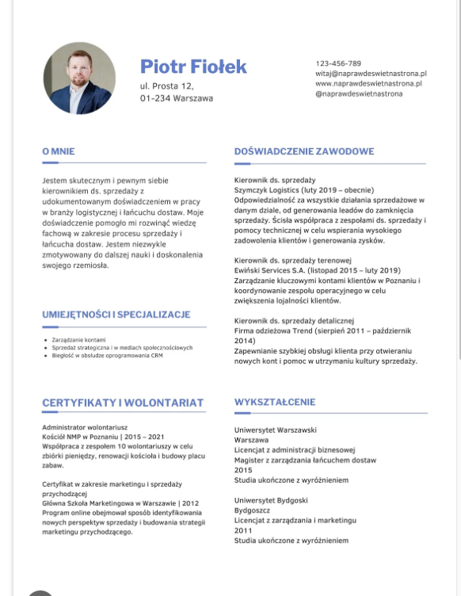
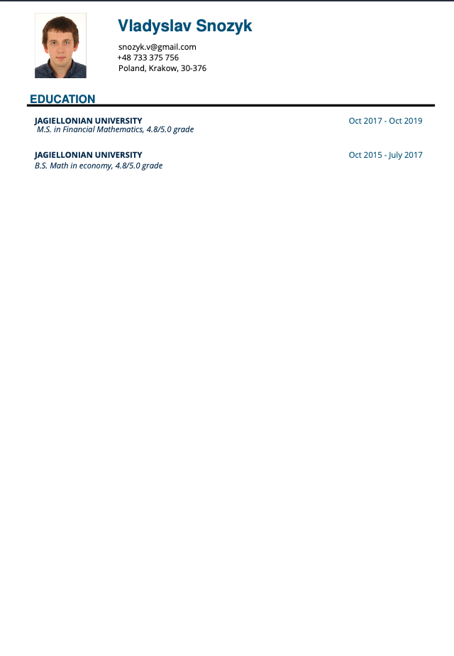
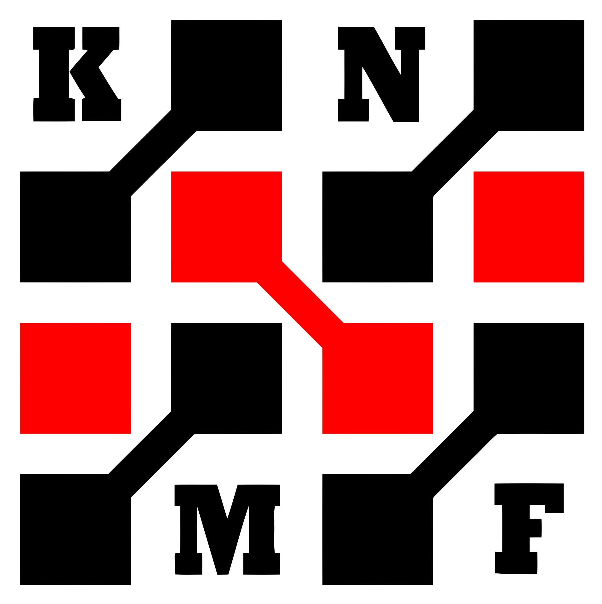
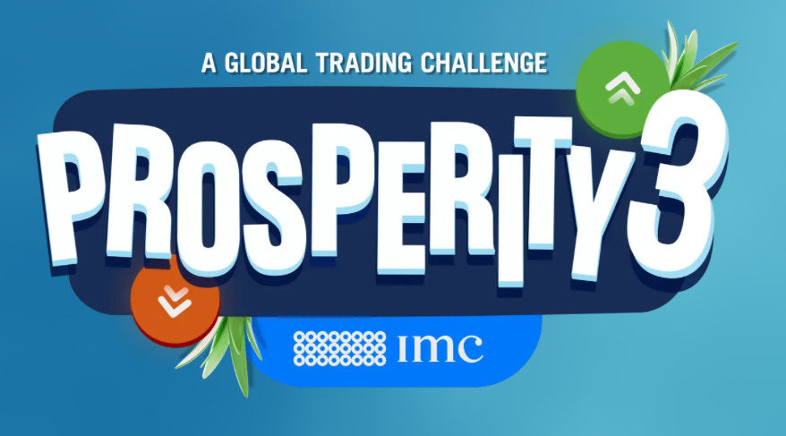

# Co robić na studiach, żeby było co wpisać do CV
**Autor:** Vlad Snozyk
**Data:** Kacwin, 2025

---
## Motywacja

---
## Motywacja

---
## Dla kogo prezentacja?

---
## Członkowstwo w kołach naukowych

---
## Dobieranie dodatkowych przedmiotów na uczelni

1. Programowanie w języku Python
2. Programowanie w języku R
3. Sieci neuronowe
4. Sterowanie stochastyczne w czasie ciągłym
5. Inżynieria finansowa
6. Arbitrage theory

---
## Projekty na GitHubie (Przedmioty z projektami)

---
## Platforma Project Euler

---
## Konkursy (Prosperity)

---
## Kaggle

---
## numer.ai

---
## Slajd o miłości

---
## Pytania

Czy są jakieś pytania?

---
## Podziękowanie

Dziękuję.
